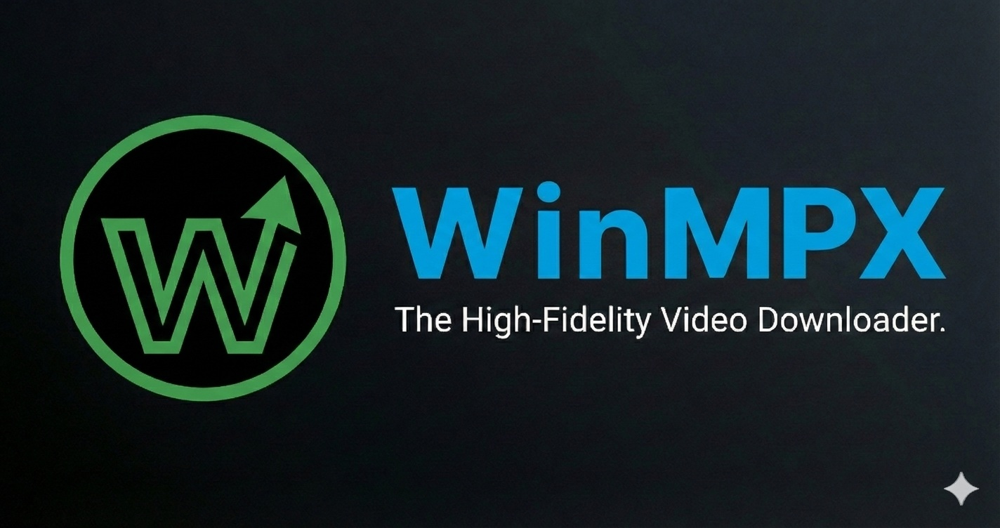
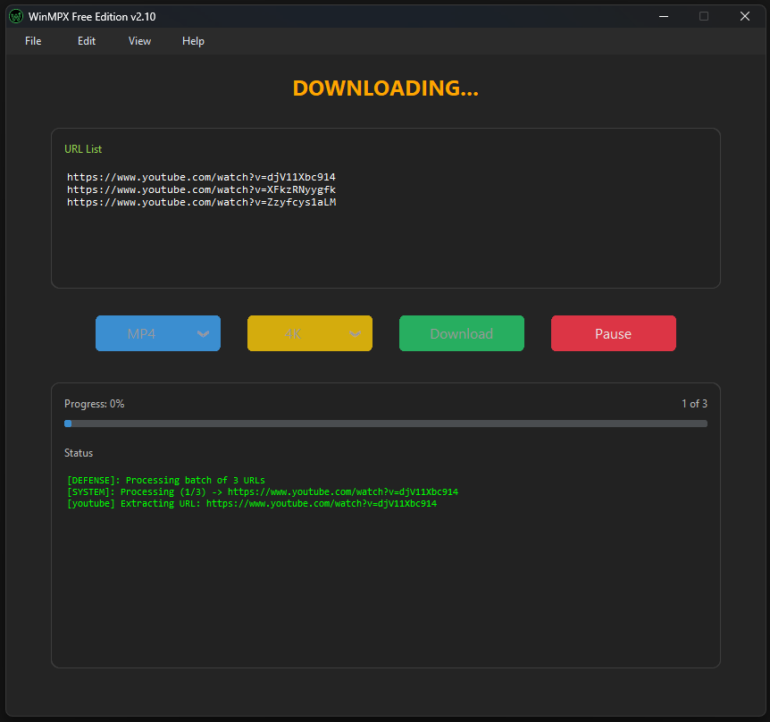

  
    
  <h1>WinMPX 🚀</h1>
  
<b>High-Fidelity Video Downloader for Windows. 8K Ready. Zero Ads.</b>

  
  

---

## 📥 Quick Download

| Edition | Windows 10 / 11 | Status |
| :--- | :---: | :---: |
| **📦 Installer (Recommended)** | **[⬇️ Download WinMPX_Setup.exe](https://github.com/WinandsLabs/WinMPX-distribution/releases/latest/download/WinMPX_Setup_v2.11.exe)** | ✅ Stable |
| **🎒 Portable (No Admin)** | [⬇️ Download Portable .zip](https://github.com/WinandsLabs/WinMPX-distribution/releases/latest/download/WinMPX_Portable_v2.11.zip) | ✅ Portable |

> **Note:** WinMPX is 100% Free and Clean. No Ads. No Spyware. No Registration.

---

## 📸 Interface

*(The high-performance MPX video downloader tool designed for efficiency and precision.)*

---

## 🛡️ Installation & Security (SmartScreen)

As independent developers, we distribute WinMPX directly to our users. Because this specific version is a new release, **Windows SmartScreen** may display an "Unrecognized App" warning while we build global reputation.

**To complete the installation:**
1. Click **"More Info"** (Más información) on the warning dialog.
2. Click **"Run anyway"** (Ejecutar de todas formas).

> **Our Commitment to Safety:** Winands Labs takes security seriously. Every release is scanned and verified for integrity. You may verify the installer yourself by uploading it to [VirusTotal](https://www.virustotal.com/) to check against 70+ industry-standard antivirus engines.

---

## ✨ Features

* **Minimalistic Design:** A professional, distraction-free interface focused on performance.
* **Up to 8K Resolution:** Supports downloading videos in 8K, 4K, QHD, and 1080p.
* **Audio Extraction:** Automatically converts video to high-quality MP3 or M4A audio tracks.
* **Batch Downloads:** Allows pasting multiple links for efficient queue handling.
* **No Ads:** The application is completely ad-free.
* **Low Memory Usage:** Designed to be resource-efficient.
* **No Tracking:** Respects user privacy with no collection of usage data or personal information.
* **Broad Platform Support:** Downloads from YouTube, Facebook, X (Twitter), Instagram, TikTok, Vimeo, SoundCloud, Reddit, Twitch, and over 100 other sites.

---

## 🛠️ Project Roadmap

Winands Labs is committed to the continuous improvement of our tools:

- [x] **Official Web Portal:** Launched at [winmpx.com](https://winmpx.com) 🚀
- [ ] **Standardized Code Signing:** Transitioning to EV Certification to streamline installation.
- [ ] **Advanced Processing:** Regular updates to video and audio processing modules.

---

## 💬 Feedback & Support

We value user input to keep WinMPX at the forefront of the industry.

* **GitHub Issues:** Open a ticket in our [Issues](../../issues) section.
* **Direct Support:** Contact our team at `support@winmpx.com`.

  © 2026 Winands Labs. Thank you for choosing our professional video downloader solution.

